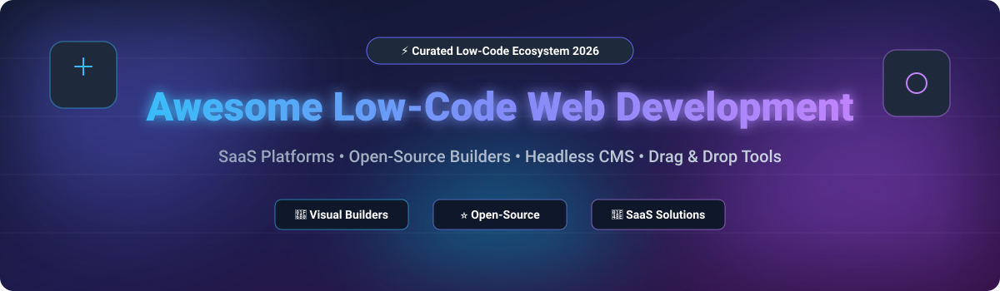

# 🚀 Awesome Low-Code & No-Code Web Development

  
  
  
  
  

  

## 📌 Top Low-Code & No-Code Web Development Platforms Ecosystem 🌐✨

**Curated List of SaaS Products & Open-Source GitHub Projects for Rapid Web Creation**

*Focused on Visual Website Builders, No-Code/Low-Code Web Apps, Drag-and-Drop Design Editors, Headless CMS-Driven Sites & Enterprise Web Publishing.*

**Last updated: October 2026** 📅

---

### 🔍 Overview & SEO Highlights 🎯

This repository tracks top-tier **SaaS platforms**, **visual website builders**, and **open-source projects** for **Low-Code & No-Code Web Development**. These modern visual development tools empower designers, marketers, startup founders, product managers, and software engineers to create production-ready responsive websites, internal applications, custom dashboards, and web applications with minimal hand-coding while maintaining high scalability, security, enterprise performance, and design fidelity.

*   **SaaS Industry Leaders:** Microsoft Power Pages, Webflow, Bubble, Wix Studio, Squarespace, WordPress.com, Framer, WeWeb, Duda, and Softr.
*   **Open-Source Foundations:** Strapi, NocoDB, PocketBase, Ghost, Appsmith, Payload CMS, Directus, ToolJet, Refine, GrapesJS, Budibase, Activepieces, WordPress, Formbricks, Plasmic, and Webiny.

---

## 📑 Table of Contents 📚

- [📊 Market Analysis](#-market-analysis-)
- [💼 SaaS/Hosted Platforms](#-saashosted-platforms-)
- [🔓 Open-Source GitHub Projects](#-open-source-github-projects-)
- [🤝 How to Contribute](#-how-to-contribute-)
- [💖 Support & Sponsorship](#-support--sponsorship-)
- [⭐ Star History](#-star-history)
- [⚠️ Disclaimer](#-disclaimer-)

---

## 📊 Market Analysis 📈

> **💡 Market Overview:** The global Website Builder & Low-Code Web Development market is estimated at **$3.5B – $6.0B** (expanding to **$40B+** when including enterprise Low-Code Application Development Platforms / LCAP). The sector is **moderately fragmented** with major platforms (Microsoft, Wix, Squarespace, Webflow) commanding core market share while specialized visual web builders and open-source ecosystems compete dynamically for developer and niche vertical segments.

---

## 💼 SaaS/Hosted Platforms 🛍️

| Platform | Starting Price (Paid) 💰 | Free Tier / Trial Limits 🎁 | Company Size (Valuation / Revenue) 📈 | Description 📝 |
| :--- | :--- | :--- | :--- | :--- |
| **[Microsoft Power Pages](https://powerpages.microsoft.com/)** | $200/mo (100 auth users pack) or $4/user/mo pay-as-you-go | 30-day free trial (requires work/school email account) | ~$3.1T Valuation (Microsoft Parent) / Power Platform $2B+ ARR | Microsoft’s low-code platform for building secure, data-driven external-facing websites integrated with Power Platform, Dataverse, and Microsoft 365. |
| **[Squarespace](https://www.squarespace.com/)** | $16/mo (billed annually) or $25/mo (monthly) | 14-day free trial (site hidden from public & search engines until paid) | $7.2B Valuation (Acquired by Permira) / ~$1.1B ARR | All-in-one website builder known for polished templates, integrated commerce, scheduling, and design-focused editing experience. |
| **[Wix Studio](https://www.wix.com/studio)** | $19/mo (billed annually) | Free plan (500 MB storage, 1 GB bandwidth, wixsite.com subdomain, Wix ads) | ~$4.5B Market Cap / $1.99B ARR | Professional-grade visual website builder from Wix aimed at agencies and designers, with advanced design tools, responsive controls, and business features. |
| **[Webflow](https://webflow.com/)** | $15/mo (billed annually) or $25/mo (monthly) | Starter plan (2 static pages, 50 CMS items, webflow.io subdomain, 50 form fills) | $4.0B Valuation / ~$212M ARR | Leading visual web design and development platform that gives designers precise control over layout, interactions, and CMS-driven sites with clean code export options. |
| **[Framer](https://www.framer.com/)** | $10/mo (billed annually) or $15/mo (monthly) | Free plan (1,000 pages, 10 CMS collections, framer.website subdomain, Framer badge) | $2.0B Valuation / ~$50M ARR | Design-first website builder with advanced animations, interactions, and a modern visual editor popular among product and marketing teams. |
| **[Bubble](https://bubble.io/)** | $29/mo (billed annually) or $32/mo (monthly) | Free plan (Development mode only, limited workload units, bubbleapps.io subdomain, no custom domain) | ~$1.8B Valuation / ~$70M ARR | Full-stack no-code platform for building complex web applications with databases, workflows, user authentication, and plugins—beyond static websites. |
| **[WordPress.com](https://wordpress.com/)** | $4/mo (billed annually) or $9/mo (monthly) | Free plan (1 GB storage, wordpress.com subdomain, WordPress ads) | ~$1.0B Valuation (Automattic) / ~$300M ARR | Hosted versions of the WordPress ecosystem offering simplified management, themes, and plugins while the core software remains open-source. |
| **[Duda](https://www.duda.co/)** | $19/mo (billed annually) or $25/mo (monthly) | 14-day free trial (no credit card required) | ~$500M Valuation / ~$41M ARR | Website builder platform tailored for agencies and freelancers, with client management, white-label options, and responsive design tools. |
| **[Softr](https://www.softr.io/)** | $49/mo (billed annually) or $59/mo (monthly) | Free plan (5 app users, 5,000 records, softr.app subdomain, no custom domain) | ~$150M Valuation / ~$15M ARR | No-code platform that turns Airtable, Google Sheets, or other data sources into client portals, internal tools, and membership websites. |
| **[WeWeb](https://www.weweb.io/)** | $16/mo (billed annually) or $20/mo (monthly) | Free plan (1 dev seat, 500 app sessions, weweb-preview.io subdomain, no code export) | ~$30M Valuation / ~$3.2M ARR | No-code web app builder focused on flexibility, code export, and connecting to external backends and APIs. |

---

## 🔓 Open-Source GitHub Projects ⚡

Below is a curated list of top open-source web development platforms, headless CMS, and low-code frameworks, **sorted by GitHub_Stars_Count (descending)**.

- **[Strapi](https://github.com/strapi/strapi)**  🌟  
  Leading open-source headless CMS in JavaScript/TypeScript that gives developers complete API customization while offering a sleek admin panel for content editors.

- **[NocoDB](https://github.com/nocodb/nocodb)**  🌟  
  Open-source Airtable alternative that turns any MySQL, PostgreSQL, SQL Server, or SQLite database into a smart spreadsheet-like web interface.

- **[PocketBase](https://github.com/pocketbase/pocketbase)**  🌟  
  Open-source Go backend consisting of an embedded SQLite database, real-time subscriptions, user auth management, and an instant web admin dashboard.

- **[Ghost](https://github.com/TryGhost/Ghost)**  🌟  
  Independent, open-source technology platform for modern publishing, membership sites, subscriptions, and newsletters with a clean writing UI.

- **[Appsmith](https://github.com/appsmithorg/appsmith)**  🌟  
  Open-source low-code developer platform to build internal web applications, admin panels, and custom dashboards by dragging UI components and binding JavaScript.

- **[Payload CMS](https://github.com/payloadcms/payload)**  🌟  
  TypeScript-native headless CMS and web application framework built on Next.js, offering developer-first code configuration and automatic admin UI generation.

- **[ToolJet](https://github.com/ToolJet/ToolJet)**  🌟  
  Extensible open-source low-code framework to quickly build business web tools and connect to databases (PostgreSQL, MongoDB), cloud storage, and REST APIs.

- **[Directus](https://github.com/directus/directus)**  🌟  
  Open-source data platform that wraps custom SQL databases with dynamic GraphQL/REST APIs and an intuitive, no-code data management app.

- **[Refine](https://github.com/refinedev/refine)**  🌟  
  Open-source React meta-framework for building enterprise internal tools, admin panels, B2B apps, and dashboards with minimal setup.

- **[GrapesJS](https://github.com/GrapesJS/grapesjs)**  🌟  
  Free, multi-purpose open-source Web Builder Framework that enables drag-and-drop HTML/CSS template creation inside custom CMS platforms and web applications.

- **[Budibase](https://github.com/Budibase/budibase)**  🌟  
  Open-source low-code platform for building modern internal web apps, forms, workflows, and client portals in minutes.

- **[Activepieces](https://github.com/activepieces/activepieces)**  🌟  
  Open-source no-code business automation tool and Zapier/Make alternative designed for connecting web applications and automating web workflows.

- **[WordPress](https://github.com/WordPress/WordPress)**  🌟  
  The ubiquitous open-source web platform powering over 40% of the web, featuring full-site block editing, thousands of themes, and massive plugin extensibility.

- **[Formbricks](https://github.com/formbricks/formbricks)**  🌟  
  Open-source survey software and experience management platform tailored for web application integration and in-product user feedback.

- **[Webiny](https://github.com/webiny/webiny-js)**  🌟  
  Open-source serverless CMS and application framework built on React and Node.js for creating scalable enterprise web portals and static site generators.

- **[Plasmic](https://github.com/plasmicapp/plasmic)**  🌟  
  Visual page builder and headless CMS that integrates directly with Next.js, React, Vue, or Gatsby codebases for seamlessly blended visual design and custom code workflows.

---

## 🤝 How to Contribute 🛠️

1. 🍴 **Fork** the repository.
2. 📝 **Add or edit** entries in `README.md` following the tabular format or bullet structure.
3. ℹ️ **Provide** accurate details: name, site link, Stars_Badge (if open-source), 1-2 sentence description, and pricing/trial limits.
4. 🚀 **Submit** a Pull Request with a clear description of your additions.

---

## 💖 Support & Sponsorship ☕

If you find this curated list of **Low-Code & No-Code Web Development Platforms** helpful:
- ⭐ **Star** this repository to show your appreciation!
- 🍴 **Fork** and share it with fellow developers, designers, and web creators!
- ☕ **Sponsor & Buy Me a Coffee:** Support ongoing maintenance and curation of open-source resources via [GitHub Sponsors](https://github.com/sponsors/ishandutta2007).

---

## ⭐ Star History

---

## ⚠️ Disclaimer 🛡️

- This is a **community-curated** list intended solely for informational purposes—it is not an exhaustive registry nor an endorsement.
- Web platforms process user data, handle payments, and manage server security. Always perform security, compliance, and architectural audits prior to deploying web systems in production environments.

---

<b>Made with ❤️ for designers, developers, marketers, and open-web advocates.</b>

